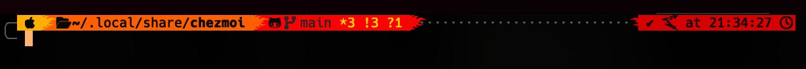

<div align="center">
    <h1>
        <a name="top" title="dotfiles">📂</a><br/>EelisK dotfiles<br/>
        <sup>
            <sub>
                powered by <a href="https://www.chezmoi.io/">chezmoi</a> ⚙️
            </sub>
        </sup>
    </h1>
    <p>My personal system configurations all bootstrapped with a single command ✨ </p>
</div>

---

<div align="center">
    
</div>

## Setup 💻

Simply run:

```sh
sh -c "$(curl -fsLS get.chezmoi.io)" -- init --apply EelisK
```

## Tools 🛠️

- [`NvChad`](https://nvchad.com/) - as an IDE
- [`alacritty`](https://github.com/alacritty/alacritty) - OpenGL terminal emulator
- [`tmux`](https://github.com/tmux/tmux) - terminal multiplexer
- [`oh-my-zsh`](https://github.com/ohmyzsh/ohmyzsh/) - zsh configurations with omz
- [`bash-it`](https://github.com/Bash-it/bash-it) - bash configurations with bash-it
- [`homebrew`](https://github.com/Homebrew/brew) - Cross-platform package management with brew
- and more! ✨
